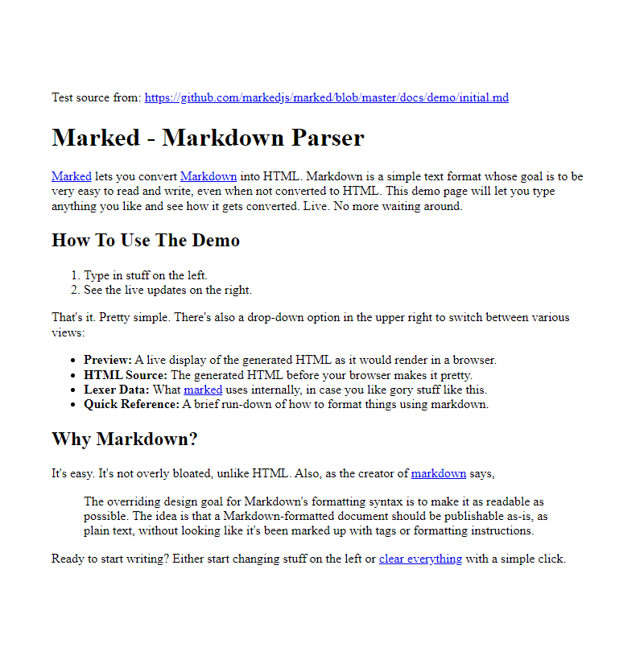
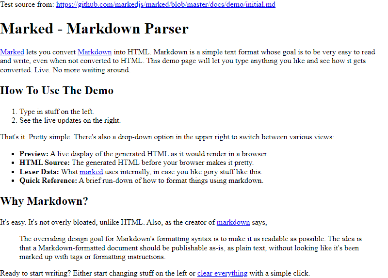
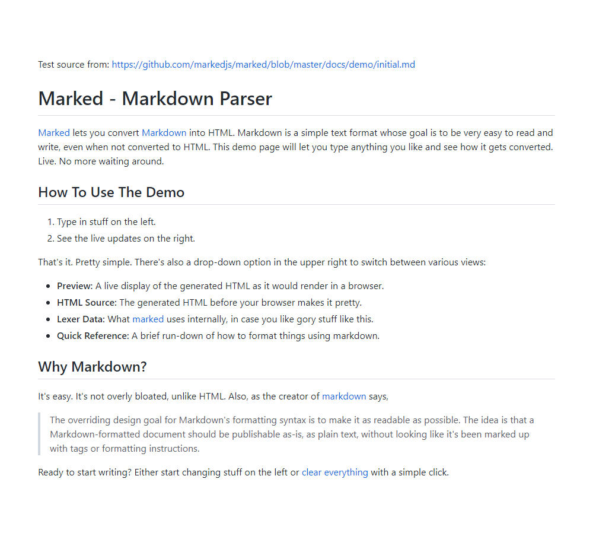
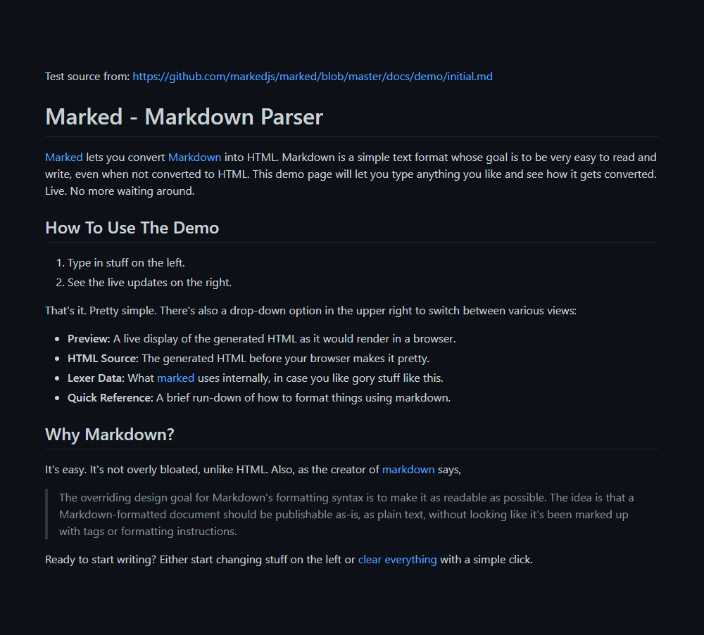
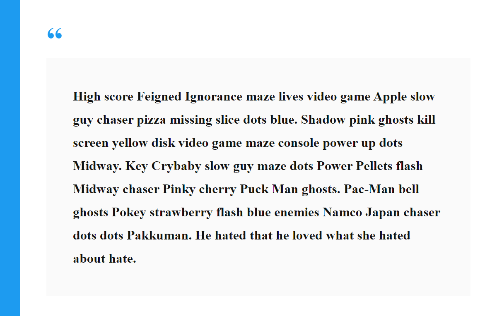

# mdimg

A tool that can be used to convert Markdown or HTML format text to an image.

## How does it work?

First, the script calls [marked](https://github.com/markedjs/marked) to parse Markdown into a HTML document. Next, use [Puppeteer](https://github.com/puppeteer/puppeteer) to start a headless browser and render the document with preset HTML and CSS files. Finally, export our image through Puppeteer's [screenshot](https://pptr.dev/#?product=Puppeteer&show=api-pagescreenshotoptions) API.

## Preview

Template|Preview|Notes
---|---|---
**Default**||
**Empty**||Not using any CSS presets
**Github**||
**Github Dark**||
**Words**||It is recommended to use with **plain text only**

## Installation

CLI:

```bash
npm install -g mdimg
```

In Node.js project:

```bash
npm install mdimg
```

## Usage

### CLI

Example:

```bash
mdimg -i input.md -o output.png -w 600 --css github
```

mdimg will read text from `input.md` and convert it to an image file `output.png`.

When using the command, you must specify either `-i` (input file, recommended) or `-t` (directly input text).

### In Node.js project

Import mdimg to your project:

```js
const { convert2img } = require('mdimg')

// or use import
import { convert2img } from 'mdimg'
```

Convert markdown text or file to image:

```js
const convertRes = await convert2img({
  mdFile: 'path/to/input.md',
  outputFilename: 'path/to/output.png',
  width: 600,
  cssTemplate: 'github',
})

console.log(`Convert to image successfully!\nFile: ${convertRes.data}`)
```

When using `convert2img()` method, you must specify either `mdFile` (input file) or `mdText` (directly input text).

Options:

| Argument       | Type      | Default                         | Notes                                                                                                                                                                                              |
| -------------- | --------- | ------------------------------- | -------------------------------------------------------------------------------------------------------------------------------------------------------------------------------------------------- |
| mdText         | `String`  | `null`                          | Input Markdown or HTML text directly. This option **has no effect** if `mdFile` is specified                                                                                                       |
| mdFile         | `String`  | `null`                          | Read Markdown or HTML text from a file                                                                                                                                                             |
| htmlTemplate   | `String`  | `default`                       | HTML rendering template. Available templates can be found in `template/html`                                                                                                                       |
| cssTemplate    | `String`  | `default`                       | CSS rendering template. Available templates can be found in `template/css`                                                                                                                         |
| width          | `Number`  | `800`                           | The width of output image                                                                                                                                                                          |
| encoding       | `String`  | `binary`                        | The encoding of output image. Available value can be `binary` or `base64`. If `binary`, return data will be the image's path. If `base64`, return data will be the image's base64 encoding string. |
| outputFilename | `String`  | `mdimg_output/mdimg_${now}.png` | Output binary image filename. File type can be `jpeg`, `png` or `webp`, defaults to `png`. Available when `encoding` option is `binary`                                                            |
| log            | `Boolean` | `false`                         | Show preset console log                                                                                                                                                                            |

## Development

```bash
git clone https://github.com/LolipopJ/mdimg.git
cd mdimg
yarn
# npm install
```

### Custom template

Templates are stored in the `template` directory.

When you use the following command:

```bash
mdimg -i input.md --html custom --css custom
```

The mdimg will read `custom.html` from `template/html` directory as HTML template and `custom.css` from `template/css` directory as CSS template to render the image result.

#### HTML template

Create a new `.html` file in `template/html` directory.

There is only one rule you need to follow: an element with id `mdimg-body` wrapping an element with class `markdown-body`.

The simplest example:

```html
<div id="mdimg-body">
  <div class="markdown-body" />
</div>
```

The mdimg will put the parsed HTML content in the element with class `markdown-body` (elements inside will be replaced), and finally generate the image for the whole element whose id is `mdimg-body`.

#### CSS template

It is recommended that write `.scss` or `.sass` files in the `template/scss` directory, and use the following command to generate CSS templates:

```bash
# Build .scss and .sass files
npm run rollup:sass
```

CSS templates with the corresponding name will be generated in `template/css` directory.

### Lint

```bash
# Check .js syntax only
npm run lint
# Check and fix syntax
npm run prettier
```

### Build

```bash
# Build .js, .scss and .sass files
npm run build
```

### Test

```bash
# You should build before testing
npm run test
```

## Inspired by

- [md2img](https://github.com/363797271/md2img). Provided me the idea and a complete feasible solution.
- [marked](https://github.com/markedjs/marked). Learned a possible method to write a JavaScript library.
